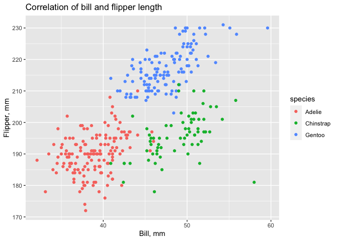

p8105\_hw1\_ao2671
================
Anna Ostropolets
9/13/2020

# Problem 1

    ## # A tibble: 10 x 4
    ##    vec_norm_distr vec_logical vec_char vec_factor
    ##             <dbl> <lgl>       <chr>    <fct>     
    ##  1          0.365 TRUE        first    green     
    ##  2          1.44  TRUE        second   black     
    ##  3          1.14  TRUE        third    blue      
    ##  4          0.854 TRUE        forth    black     
    ##  5          0.980 TRUE        fifth    blue      
    ##  6         -0.141 FALSE       sixth    blue      
    ##  7          0.210 TRUE        seventh  green     
    ##  8         -0.177 FALSE       eighth   blue      
    ##  9          0.112 TRUE        ninth    green     
    ## 10         -0.362 FALSE       tenth    green

    ## The mean of samples from distribution 0.4417269 ;
    ##  The mean of logical vector 0.7 ; 
    ##  The mean of character vector NA ;
    ##  The mean of factor vector NA

    ## Answer: We can take the mean of logical or numberic vector but not of character of factor vectors

``` r
# convert logical vector to numeric
as.numeric(data_frame$vec_logical)
# convert character vector to numeric
as.numeric(data_frame$vec_char)
# convert factor vector to numeric
as.numeric(data_frame$vec_factor)

#logical variables can be converted to numbers where 1 is TRUE and 0 is FALSE, 
#factor can be converted to numbers according to the number of levels 
#and character variables cannot be converted to numbers. 
#This is why we can take the mean of logical variable but not for character variables. 
#Logical variables have to be converted to numeric prior to taking the mean
```

``` r
# convert logical vector 
logical_to_numeric = as.numeric(data_frame$vec_logical)*data_frame$vec_norm_distr
logical_to_factor = as.factor(data_frame$vec_logical)*data_frame$vec_norm_distr
logical_to_factor_to_numeric = as.numeric(as.factor(data_frame$vec_logical))*data_frame$vec_norm_distr


logical_to_numeric
```

    ##  [1] 0.3652339 1.4362747 1.1400970 0.8542329 0.9798307 0.0000000 0.2098862
    ##  [8] 0.0000000 0.1115845 0.0000000

``` r
logical_to_factor
```

    ##  [1] NA NA NA NA NA NA NA NA NA NA

``` r
logical_to_factor_to_numeric
```

    ##  [1]  0.7304677  2.8725494  2.2801940  1.7084658  1.9596614 -0.1411784
    ##  [7]  0.4197724 -0.1771272  0.2231690 -0.3615651

### Problem 2

    ## [1] "The dataset has  8  columns and contains the information about  344  pinguings from  3  species of pinguings   living on  3  islands. The date specifies their  sex  and  year as well as bill characteristics. Islands include  Biscoe, Dream, Torgersen  and species include  Adelie, Chinstrap, Gentoo Mean flipper length is  200.915204678363"

<!-- -->
